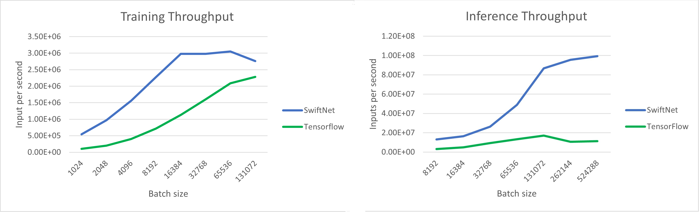

## Introduction
The goal of this repository is to implements an GPU-accelerated tiny neural network framework using Intel hardware. The implementation uses Intel DPC++ compiler and rely on both SYCL language and Intel Level-Zero API.

Because this network is tight, we are able to load both the activation matrices and the weights matrices into the GPU L1 memory ( shared memory and registers ) that corresponds to the GPU's fast memory.

The computation of the product of matrices is realised thanks to an Intel extension called joint_matrix, that is a high-level wrapper to realise systolic array operations. We also use OneMKL to realise matrices product with bigger dimension when to input or the output are too large to fit the matrix in the L1 memory and use joint_matrix.

## Performance on DG2

We benchmarked the thoughput of our network in training and inference on DG2 GPU. We compared our network with Python Tensorflow.

## Usage 
```cpp
#include <config.h>

const int batch_size = std::pow(2, 17);
    const int output_width = 128;
    const int WIDTH = 64;
    const int intermediate_output_size = batch_size * WIDTH * 4;
    const int layer_length = WIDTH * batch_size;
    const int n_hidden_matrices = 4;
    const int net_width = 64;
    const int inputs_width = 64;


    const float scale = 1e-3f;
    device dev = device(gpu_selector_v);

    std::vector<device> subdev = {};

    subdev = dev.create_sub_devices<sycl::info::partition_property::
        partition_by_affinity_domain>(sycl::info::partition_affinity_domain::numa);

    queue q = queue(subdev[0]);

    DeviceMem<bf16> inputs = DeviceMem<bf16>(batch_size * WIDTH, q);
    DeviceMem<float> output = DeviceMem<float>(batch_size * output_width, q);
    DeviceMem<float> target = DeviceMem<float>(batch_size * output_width, q);
    DeviceMem<bf16> grads = DeviceMem<bf16>(batch_size * output_width, q);
    DeviceMem<float> losses = DeviceMem<float>(batch_size * output_width, q);

    inputs.initialize_constant(bf16(1.0f), q);
    output.initialize_constant(0.0f, q);
    target.initialize_constant(8.0f, q);
    grads.initialize_constant(bf16(0.0f), q);
    losses.initialize_constant(0.0f, q);

    nlohmann::json config = {
    {"loss", {
            {"otype", "L2"}
    }},
    {"optimizer", {
            {"otype", "sgd"},
            {"output_width", 128},
            {"n_hidden_layers", 2},
            {"learning_rate", 1e-3},
            {"l2_reg", 1e-8f}
    }},
    {"encoding", {
            {"otype", "HashGrid"},
            {"n_levels", 16},
            {"n_features_per_level", 2},
            {"log2_hashmap_size", 19},
            {"base_resolution", 16},
            {"per_level_scale", 2.0},
    }},
    {"network", {
            {"otype", "SwiftNetMLP"},
            {"activation", "None"},
            {"output_activation", "None"},
            {"n_neurons", 64},
            {"n_hidden_layers", 4},
    }},
    };

    auto model = create_from_config(q, config);


    model.trainer.initialize_params();

    for (int i = 0; i < 1000; i++) {
        std::cout << i << std::endl;
        model.trainer.training_step(inputs,
            model.network->m_forward,
            model.network->m_act_mem,
            model.network->m_act_mem_temp,
            model.network->m_A_forward,
            model.network->m_B_forward,
            model.network->m_C_forward,
            model.network->m_out_inter,
            model.network->m_deltas_temp,
            model.network->m_deltas,
            model.network->m_A_backward,
            model.network->m_B_backward,
            model.network->m_C_backward,
            model.network->m_A_backward_last_layer,
            model.network->m_B_backward_last_layer,
            model.network->m_C_backward_last_layer,
            model.network->m_D_backward_last_layer,
            model.network->m_E_backward_last_layer,
            model.network->m_F_backward_last_layer,
            model.network->m_A_dgemm,
            model.network->m_B_dgemm,
            model.network->m_C_dgemm,
            output,
            target,
            grads,
            losses,
            scale,
            WIDTH);
    }

    inputs.free_mem(q);
    output.free_mem(q);
    target.free_mem(q);
    grads.free_mem(q);
    losses.free_mem(q);

    model.network->free_mem(q);

    return 0;

```

## Build

To build the tiny-nn librairy, you can clone the github repo on your machine and put your code in the source folder.
Then you can build the library using :

```sh
user$ source /opt/intel/oneapi/setvars.sh intel64
user$ make <options>
```


<options> can be dg2 or pvc depending on the hardware you want to build for.

## Required Hardware and Framework
XMX hardware on GPU or AMX on CPU.
DPC++ with level zero.


